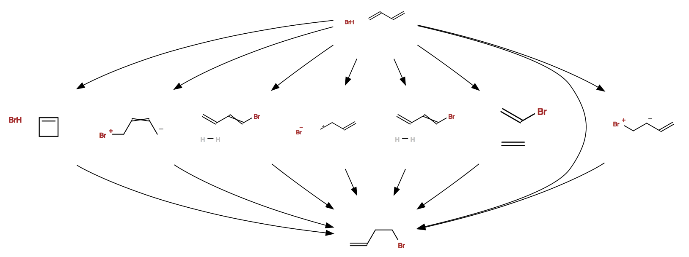

# Global Reaction Route Mapping Tool
This tool is able to search for the most possible reaction pathways given a reactant and a product, 
under various user-defined restrictions. The result will be shown as a graph in a webpage. 
The purpose of this tool is to save time and money for exploring new synthesis route by pre-screening 
possible reaction routes, as well as to provide mechanistic insight for reactions that has an undetermined mechanism. 
# Demo
The demo supports simple reaction route searching. It requires a reactant and a target product be provided to search for possible reaction pathways between them. Energy calculation and transition state searching are not supported by the demo. 
# How it works
From reactant, the tool explores every possible bond changes or combinations of them under some pre-defined rules, 
add the obtained structures to the next generation of intermediates, subject to some screening. Then it transforms every
intermediates in the next generation according to bond change rules, and adds the obtained structures to the third generation. 
Then it repeats the breadth-first-search process until the target is found. 
# Bond Changing Rules
- No more than two bond breakings and two bond formations simultaniously
- Diels-Alder reaction is considered as a special case because it involves three bond breakings and three bond formations
- All atoms in post-change structures should have a stable coordination number
# Options
## Inactive Atoms
User can define inactive atoms, which will not be subject to bond changes. For large systems, it is recommended that 
only the reaction core be chosen as active atoms to reduce computational cost. 
## Calculation Details
- Whether energy and/or transition state calculation is done
- Software and keywords to be used for energy calculation
- Whether energy screen is enabled for intermediate energy and/or transition state structures
## Long Reaction Route Tolerance
This option decides how many extra steps are allowed after the target is found. 
# Examples
- reactant(SMILES): C=C-C=C.Br
- product(SMILES): C=CCCBr

